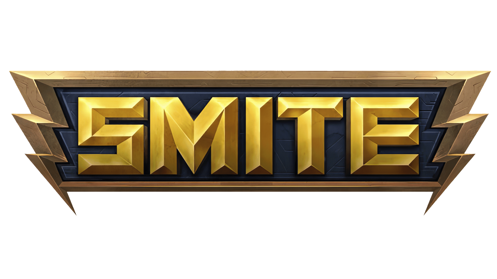

<h1 align="center">
   
</h1>
 

  <a href="#-projeto">Project</a>&nbsp;&nbsp;&nbsp;|&nbsp;&nbsp;&nbsp;
  <a href="#-tecnologias">Technologies</a>&nbsp;&nbsp;&nbsp;|&nbsp;&nbsp;&nbsp;
  <a href="#-usage">Usage</a>&nbsp;&nbsp;&nbsp;|&nbsp;&nbsp;&nbsp;
  <a href="#-participants">Participants</a>

 

## 💻 Project

🎮🕹 This project is the Smite interface, a game that I love. ❤ 
It was developed with all the words in brazilian portuguese 🇧🇷 because it is the language that I use when I play 😅

Note: I use generic 3D models because I haven't found a 3D model of a smite character free to use, so I use some of the 3D objects that come with Windows.

    

## 🚀 Technologies

This project was developed with the following technologies:

- [React](https://reactjs.org/)
- [Next JS](https://nextjs.org/)
- [Typescript](https://www.typescriptlang.org/)
- [SASS](https://sass-lang.com/)
- [Google Model Viewer](https://modelviewer.dev/)

## 💻 Usage

 ### Mobile App
  
    $ yarn to install the dependencies.
    
    $ yarn build

    $ yarn start
    

## 👥 Participants

[Samuel Formigheri](https://github.com/SamuelFormigheri)